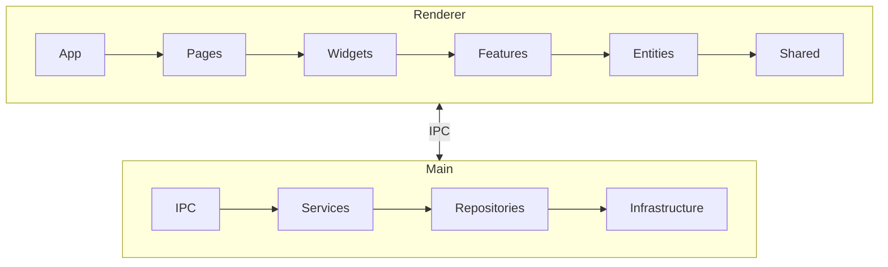

# Auto Documentation Prompts

## Usage
코드 변경 시 자동 문서화를 위한 프롬프트 모음

---

## Full Documentation

```
프로젝트 전체 문서를 생성해주세요.

## 프로젝트 정보
- 이름: [프로젝트명]
- 경로: [프로젝트 경로]
- 기술 스택: [주요 기술]

## 생성할 문서
1. [ ] ARCHITECTURE.md - 시스템 구조
2. [ ] API.md - API 레퍼런스
3. [ ] COMPONENTS.md - 컴포넌트 문서 (프론트엔드)
4. [ ] CHANGELOG.md - 변경 로그

## 요구사항
- Mermaid 다이어그램 포함
- 코드 예제 포함
- 한국어로 작성
```

---

## Architecture Documentation

```
아키텍처 문서를 생성/갱신해주세요.

## 분석 대상
- 디렉토리: [src/ 경로]
- 패턴: [FSD, Layered 등]

## 문서 내용
1. 시스템 개요
2. 모듈 구조 (Mermaid 다이어그램)
3. 레이어별 책임
4. 데이터 흐름
5. 의존성 규칙

## 출력 위치
- docs/architecture.md
```

---

## API Documentation

```
API 문서를 생성해주세요.

## 대상
- Backend: [Express/Fastify 라우트 경로]
- IPC: [Electron IPC 핸들러 경로]

## 문서 형식
각 엔드포인트/채널에 대해:
- 설명
- 요청 파라미터 (타입 포함)
- 응답 형식 (JSON 예제)
- 에러 케이스
- 사용 예제

## 출력 위치
- docs/api.md
```

---

## Component Documentation

```
React 컴포넌트 문서를 생성해주세요.

## 대상 경로
- [src/renderer/shared/components/]
- [src/renderer/widgets/]

## 각 컴포넌트에 대해
1. 컴포넌트 설명
2. Props 테이블 (타입, 기본값, 설명)
3. 사용 예제
4. 스타일링 옵션

## 출력 형식
```markdown
## ComponentName

### 설명
[컴포넌트 목적]

### Props
| Prop | Type | Default | Description |
|------|------|---------|-------------|

### 사용 예제
```tsx
<ComponentName prop="value" />
```
```
```

---

## Changelog Update

```
CHANGELOG를 갱신해주세요.

## 변경 내용 분석
```bash
git diff [이전 버전]..HEAD
```

## 버전 정보
- 현재 버전: [x.y.z]
- 새 버전: [x.y.z]
- 릴리즈 날짜: [YYYY-MM-DD]

## 분류 기준
- Added: 새로운 기능
- Changed: 기존 기능 변경
- Deprecated: 곧 제거될 기능
- Removed: 제거된 기능
- Fixed: 버그 수정
- Security: 보안 관련

## 출력 위치
- CHANGELOG.md
```

---

## Incremental Update

```
최근 변경 사항을 분석하고 문서를 갱신해주세요.

## 변경 범위
```bash
git diff HEAD~[N]..HEAD --name-only
```

## 분석 항목
1. 어떤 파일이 변경되었는가?
2. 구조적 변경이 있는가?
3. API 변경이 있는가?
4. Breaking change가 있는가?

## 갱신 대상 문서
- [ ] ARCHITECTURE.md (구조 변경 시)
- [ ] API.md (API 변경 시)
- [ ] CHANGELOG.md (항상)
- [ ] README.md (주요 기능 변경 시)

## 응답 형식
### 변경 분석
- [변경 유형]: [설명]

### 문서 갱신 내용
- [문서명]: [갱신 내용 요약]

### 갱신된 문서 내용
[실제 문서 내용]
```

---

## Quick Doc Check

```
현재 문서가 코드와 일치하는지 확인해주세요.

## 확인 대상
- [ ] 모든 public 함수가 문서화되었는가?
- [ ] API 문서가 실제 엔드포인트와 일치하는가?
- [ ] 아키텍처 다이어그램이 현재 구조를 반영하는가?
- [ ] 예제 코드가 동작하는가?

## 응답 형식
### 불일치 항목
| 위치 | 문서 내용 | 실제 코드 | 수정 필요 |
|------|----------|----------|----------|

### 누락 항목
- [문서화되지 않은 항목 목록]

### 권장 조치
1. [조치 1]
2. [조치 2]
```

---

## Mermaid Diagram Generation

```
프로젝트 구조를 Mermaid 다이어그램으로 시각화해주세요.

## 다이어그램 유형
1. [ ] 모듈 의존성 (flowchart)
2. [ ] 데이터 흐름 (sequenceDiagram)
3. [ ] 클래스 구조 (classDiagram)
4. [ ] 상태 흐름 (stateDiagram)

## 대상
- [분석할 디렉토리/파일]

## 출력 예시

```

---

## README Update

```
README.md를 갱신해주세요.

## 현재 README 경로
[README.md 경로]

## 갱신 항목
- [ ] 프로젝트 설명
- [ ] 주요 기능 목록
- [ ] 설치 방법
- [ ] 실행 방법
- [ ] 기술 스택
- [ ] 프로젝트 구조
- [ ] 기여 가이드

## 새로 추가된 기능
[최근 추가된 기능 목록]

## 변경된 사용법
[변경된 실행/설정 방법]
```

---

## Documentation Standards

### Markdown 규칙
- 제목은 `#`으로 시작 (H1은 문서당 1개)
- 코드 블록은 언어 명시
- 테이블은 정렬 사용
- 링크는 상대 경로 사용

### 다이어그램 규칙
- Mermaid 사용
- 복잡한 경우 subgraph로 그룹화
- 화살표에 라벨 추가
- 색상은 의미에 맞게 사용

### 버전 표기
- Semantic Versioning (MAJOR.MINOR.PATCH)
- Breaking change는 MAJOR 증가
- 새 기능은 MINOR 증가
- 버그 수정은 PATCH 증가
