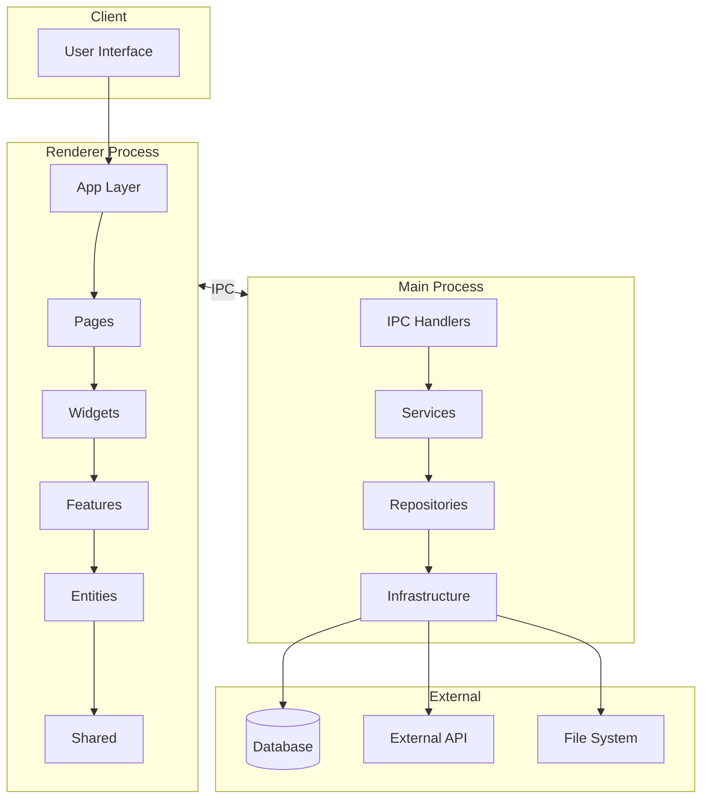
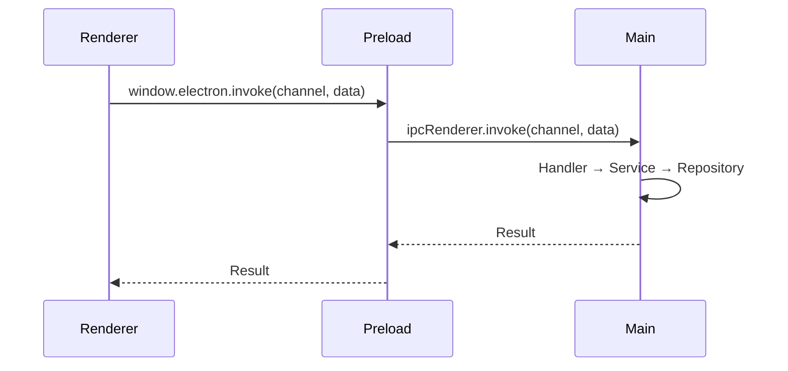

# Architecture Document Template

## Overview
[시스템 목적 및 범위 - 1-2문장으로 프로젝트가 무엇을 하는지 설명]

---

## System Diagram



---

## Modules

### Renderer (Frontend)

| 레이어 | 경로 | 책임 |
|--------|------|------|
| `app/` | `src/renderer/app/` | 앱 초기화, 프로바이더, 라우팅 |
| `pages/` | `src/renderer/pages/` | 페이지 컴포넌트, URL 라우팅 |
| `widgets/` | `src/renderer/widgets/` | 독립적 UI 블록 |
| `features/` | `src/renderer/features/` | 비즈니스 기능 |
| `entities/` | `src/renderer/entities/` | 도메인 엔티티 |
| `shared/` | `src/renderer/shared/` | 공통 유틸, UI 컴포넌트 |

### Main (Backend)

| 레이어 | 경로 | 책임 |
|--------|------|------|
| `ipc/handlers/` | `src/main/ipc/handlers/` | IPC 요청 처리 |
| `services/` | `src/main/services/` | 비즈니스 로직 |
| `repositories/` | `src/main/repositories/` | 데이터 접근 |
| `infrastructure/` | `src/main/infrastructure/` | 외부 시스템 연결 |

### Shared

| 경로 | 내용 |
|------|------|
| `src/shared/ipc/` | IPC 채널, 이벤트 정의 |
| `src/shared/types/` | 공유 타입 정의 |

---

## Data Flow

### IPC Communication


### Request/Response Flow
1. **Renderer**: 사용자 액션 발생
2. **Preload**: contextBridge로 안전한 API 노출
3. **Main Handler**: 요청 수신 및 검증
4. **Service**: 비즈니스 로직 처리
5. **Repository**: 데이터 접근
6. **Infrastructure**: 외부 시스템 통신
7. **Response**: 역순으로 결과 반환

---

## Integration Points

| 외부 시스템 | 연결 방식 | 용도 | 관련 코드 |
|------------|----------|------|----------|
| [DB명] | [SQLite/PostgreSQL] | 데이터 저장 | `src/main/infrastructure/database.ts` |
| [API명] | REST/GraphQL | [용도] | `src/main/infrastructure/api.ts` |
| File System | Node.js fs | 파일 처리 | `src/main/infrastructure/filesystem.ts` |

---

## Path Aliases

| Alias | Path | 용도 |
|-------|------|------|
| `~/*` | `src/*` | 전체 소스 |
| `@/*` | `src/renderer/*` | Renderer 전용 |
| `#/*` | `src/main/*` | Main 전용 |

---

## Dependency Rules

### Renderer (FSD)
```
app → pages → widgets → features → entities → shared
       (위에서 아래로만 import 가능)
```

### Main (Layered)
```
ipc/handlers → services → repositories → infrastructure
              (위에서 아래로만 의존)
```

---

## Risks & Tradeoffs

| 항목 | 설명 | 대응 방안 |
|------|------|----------|
| [리스크 1] | [설명] | [대응] |
| [트레이드오프 1] | [선택 이유] | [대안] |

---

## Change Log

| 날짜 | 변경 내용 | 작성자 |
|------|----------|--------|
| YYYY-MM-DD | 초기 아키텍처 문서 작성 | [이름] |
