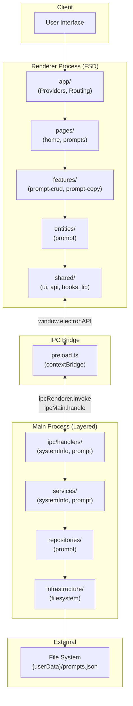
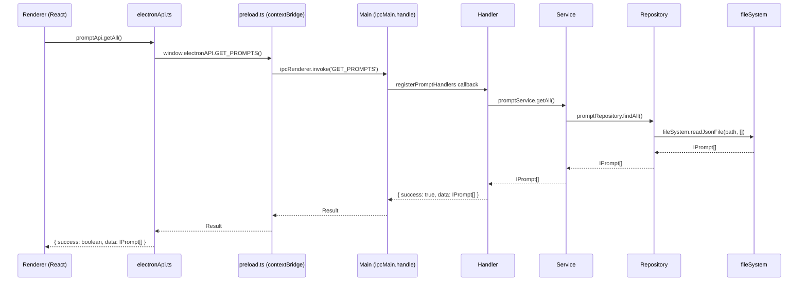

# Architecture Document

## Overview
Vibe Coding Framework -- Electron + React 기반 데스크톱 앱 스타터 템플릿.
AI 에이전트와 협업하여 코드를 생성/관리하기 위한 프레임워크로, Renderer 프로세스에는 Feature-Sliced Design(FSD), Main 프로세스에는 Layered Architecture를 채택한다.

---

## System Diagram



---

## Modules

### Renderer (Frontend) -- Feature-Sliced Design

| 레이어 | 경로 | 책임 |
|--------|------|------|
| `app/` | `src/renderer/app/` | 앱 초기화, Providers (QueryClient, BrowserRouter), 라우팅, 스타일 |
| `pages/` | `src/renderer/pages/` | 페이지 컴포넌트 -- `home/` (대시보드), `prompts/` (프롬프트 관리) |
| `features/` | `src/renderer/features/` | 비즈니스 기능 -- `prompt-crud/` (CRUD 훅 + Form + DeleteButton), `prompt-copy/` (클립보드 복사) |
| `entities/` | `src/renderer/entities/` | 도메인 엔티티 -- `prompt/` (API 래퍼, 타입, PromptCard UI) |
| `shared/` | `src/renderer/shared/` | 공통 -- `components/ui/` (Button, Card, Badge, Input, Textarea, Select), `api/` (electronApi), `hooks/` (use-mobile, use-theme), `lib/` (cn 유틸) |

### Main (Backend) -- Layered Architecture

| 레이어 | 경로 | 책임 |
|--------|------|------|
| `ipc/handlers/` | `src/main/ipc/handlers/` | IPC 요청 수신, try-catch 래핑, `{ success, data }` 응답 반환 |
| `services/` | `src/main/services/` | 비즈니스 로직 -- `systemInfoService` (런타임 정보), `promptService` (CRUD + 초기 시드), `data/defaultPrompts` |
| `repositories/` | `src/main/repositories/` | 데이터 접근 -- `promptRepository` (findAll, findById, create, update, delete, seed) |
| `infrastructure/` | `src/main/infrastructure/` | 외부 시스템 연결 -- `fileSystem` (getDataPath, readJsonFile, writeJsonFile) |

### Shared (Main + Renderer 공유)

| 경로 | 내용 |
|------|------|
| `src/shared/ipc/channels.ts` | IPC 채널 상수 정의 (`CHANNELS` as const) |
| `src/shared/ipc/events.ts` | 채널별 args/response 타입 매핑 (`IEvents` interface) |
| `src/shared/ipc/preload.ts` | `TElectronAPI` -- IEvents에서 자동 파생되는 Renderer용 API 타입 |
| `src/shared/types/prompt.ts` | `IPrompt`, `TPromptCategory`, `ICreatePromptRequest`, `IUpdatePromptRequest` |
| `src/shared/types/system-info.ts` | `ISystemInfo` |

### App (Electron Entry)

| 경로 | 내용 |
|------|------|
| `src/app/main.ts` | Electron 앱 진입점, BrowserWindow 생성 |
| `src/app/preload.ts` | contextBridge를 통한 electronAPI 노출 |
| `src/app/windows.ts` | 윈도우 생성 로직 |
| `src/app/windows-config.ts` | 윈도우 설정 |

---

## Data Flow

### IPC Communication


### Request/Response Flow
1. **Renderer**: 사용자 액션 발생 (예: 프롬프트 목록 조회)
2. **TanStack Query**: `usePrompts()` 훅이 `promptApi.getAll()` 호출
3. **Entity API**: `getElectronApi().GET_PROMPTS()` 호출
4. **Preload**: contextBridge가 `ipcRenderer.invoke(CHANNELS.GET_PROMPTS)` 실행
5. **Main Handler**: `ipcMain.handle`에서 요청 수신, try-catch로 래핑
6. **Service**: 비즈니스 로직 처리 (`promptService.getAll()`)
7. **Repository**: 데이터 접근 (`promptRepository.findAll()`)
8. **Infrastructure**: `fileSystem.readJsonFile()` -- `{userData}/prompts.json` 읽기
9. **Response**: 역순으로 `{ success: true, data }` 반환

---

## Type-Safe IPC Chain

타입 안전성을 컴파일 타임에 보장하는 3단계 체인:

```
CHANNELS (const) --> IEvents (interface) --> TElectronAPI (auto-derived type)
```

### 1단계: 채널 정의 (`src/shared/ipc/channels.ts`)
```typescript
export const CHANNELS = {
  GET_APP_VERSION: 'GET_APP_VERSION',
  GET_SYSTEM_INFO: 'GET_SYSTEM_INFO',
  GET_PROMPTS: 'GET_PROMPTS',
  CREATE_PROMPT: 'CREATE_PROMPT',
  UPDATE_PROMPT: 'UPDATE_PROMPT',
  DELETE_PROMPT: 'DELETE_PROMPT',
} as const;
```

### 2단계: 이벤트 타입 매핑 (`src/shared/ipc/events.ts`)
```typescript
export interface IEvents {
  [CHANNELS.GET_PROMPTS]: {
    args: void;
    response: { success: boolean; data: IPrompt[] };
  };
  [CHANNELS.CREATE_PROMPT]: {
    args: ICreatePromptRequest;
    response: { success: boolean; data: IPrompt };
  };
  // ...
}
```

### 3단계: Renderer API 타입 자동 파생 (`src/shared/ipc/preload.ts`)
```typescript
type TOptionalArgs<T> = T extends void ? [] : [args: T];

export type TElectronAPI = {
  [K in keyof typeof CHANNELS]: (
    ...args: TOptionalArgs<IEvents[typeof CHANNELS[K]]["args"]>
  ) => Promise<IEvents[typeof CHANNELS[K]]["response"]>;
};
```

이 체인 덕분에 채널명 오타, 잘못된 인자/응답 타입이 컴파일 타임에 잡힌다.

---

## Integration Points

| 외부 시스템 | 연결 방식 | 용도 | 관련 코드 |
|------------|----------|------|----------|
| File System | Node.js `fs` (동기) | 프롬프트 데이터 JSON 파일 저장 | `src/main/infrastructure/filesystem.ts` |

- 저장 경로: `app.getPath('userData')/prompts.json`
- 포맷: JSON 배열 (`IPrompt[]`)
- 초기 데이터: `src/main/services/data/defaultPrompts.ts`에서 시드

---

## Path Aliases

| Alias | Path | 용도 |
|-------|------|------|
| `~/*` | `src/*` | 전체 소스 (Main + Renderer + Shared) |
| `@/*` | `src/renderer/*` | Renderer 프로세스 전용 |
| `#/*` | `src/main/*` | Main 프로세스 전용 |

tsconfig.json과 vite.common.config.ts 모두에 설정이 필요하다.

---

## Dependency Rules

### Renderer (FSD)
```
app --> pages --> widgets --> features --> entities --> shared
              (위에서 아래로만 import 가능)
```
- `pages/`는 `features/`, `entities/`, `shared/`를 import할 수 있다.
- `features/`는 `entities/`, `shared/`를 import할 수 있다.
- `entities/`는 `shared/`만 import할 수 있다.
- 같은 레이어 간 import는 금지 (예: feature A가 feature B를 import 불가).

### Main (Layered)
```
ipc/handlers --> services --> repositories --> infrastructure
                (위에서 아래로만 의존)
```
- `handlers/`는 `services/`를 호출한다.
- `services/`는 `repositories/`를 호출한다.
- `repositories/`는 `infrastructure/`를 호출한다.
- 역방향 의존은 금지.

---

## Risks & Tradeoffs

| 항목 | 설명 | 대응 방안 |
|------|------|----------|
| JSON 파일 저장소 | 간단하지만 동시 접근에 취약 (`readFileSync`/`writeFileSync` 사용) | 프로토타입/showcase 수준에 적합. 프로덕션에서는 SQLite(better-sqlite3) 권장 |
| CVA 기반 컴포넌트 | shadcn/ui 패턴 채택으로 일관된 변형(variant) 관리 가능하나, class-variance-authority + tailwind-merge 번들 크기 증가 | 컴포넌트 수가 적은 MVP에서는 영향 미미. 대규모 앱에서는 트리셰이킹 확인 필요 |
| TanStack Query로 IPC 래핑 | 캐싱, staleTime, 자동 갱신, 뮤테이션 후 `invalidateQueries` 패턴 활용 가능 | Local IPC에는 과도할 수 있으나, 실 프로젝트 확장 시 네트워크 API 전환이 용이 |
| Tailwind CSS 4 `@source` 지시자 | Vite root가 `src/renderer/`이므로 `src/` 전체를 스캔 대상에 포함하려면 `@source` 필수 | `src/renderer/app/styles/index.css`에 `@source "../../../../src"` 설정 완료 |

---

## Change Log

| 날짜 | 변경 내용 | 작성자 |
|------|----------|--------|
| 2026-02-07 | 초기 아키텍처 문서 작성 | AI Agent (documentor) |
